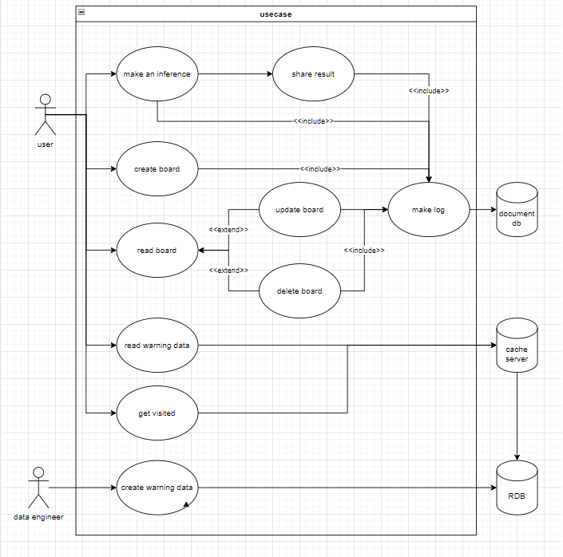
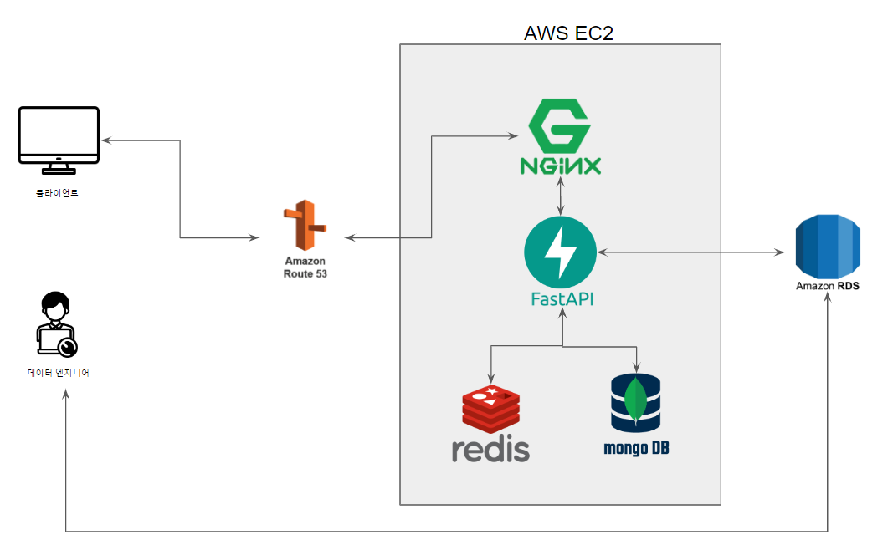

## 1. 브레인 스토밍
- 우리가 조심해야하는 위험한 사고에는 어떤것이 있을까?
- 우리가 조심해야하는 물건에는 무엇이 있을까?
- 그 물건으로 어떻게 다칠까?
  - 다치는 원인
  - 다치는 부위
- 성별에 따라 어떤 물건 때문에 많이 다치게 될까?
- 나이에 따라 어떤 물건에 많이 다칠까?
- 연도별 가장 많이 다치는 원인은 무엇일까?

- 기능적 생각
    - 가장 조심해야 하는 물건
    - 조심해야하는 물건 랭킹
    - 연도별 추이
    - 전체 추이

## 2. 요구사항 정의 & 분석
- 유스케이스 정의
 

- 사용하는 하드웨어 스펙
  - AWS, t2 micro 
    - CPU: 1 vCPU 
    - RAM: 1GB Ram
    - OS: Ubuntu, 22.04 LTS
### 데이터 수집
[공공데이터 - 한국소비자원 소비자 위해정보](https://www.data.go.kr/data/3040719/fileData.do?recommendDataYn=Y)

## 3. 설계
- 웹 아키텍처 설계
  - 참고: [[번역] Web Architecture 101](https://scvgoe.github.io/2018-12-25-%EB%B2%88%EC%97%AD-Web-Architecture-101/)

### DB 설계

## 4. 개발

## 5. 테스트
